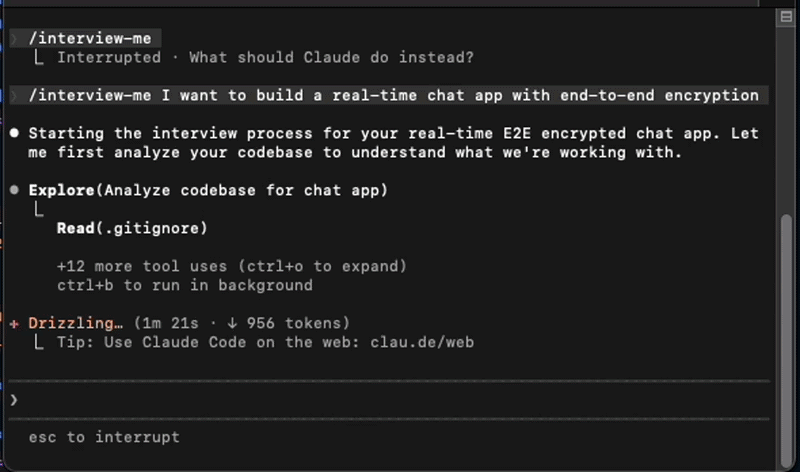

# interview-me

**A Claude Code skill that interviews you like a senior architect before you write code.**

[](https://docs.anthropic.com/en/docs/claude-code) &nbsp; [](LICENSE)



## Why This Exists

When you're building alone, there's no one to challenge your assumptions. Requirements start as vague ideas, edge cases get discovered in production, and security concerns become afterthoughts.

**interview-me** is the senior architect you wish you had on the team. It reads your requirement, scans your codebase, then asks hard questions one at a time — pushing back on contradictions, probing edge cases, and hard-blocking on security gaps. Outputs a production-grade spec with decisions log and implementation order.

Optionally generates an **interactive HTML preview** with inline commenting so you can visually review and annotate the spec before finalizing.

## Install

```bash
mkdir -p ~/.claude/skills/interview-me
curl -o ~/.claude/skills/interview-me/SKILL.md \
  https://raw.githubusercontent.com/Sorbh/interview-me/main/interview-me/SKILL.md
curl -o ~/.claude/skills/interview-me/STYLE_PRESETS.md \
  https://raw.githubusercontent.com/Sorbh/interview-me/main/interview-me/STYLE_PRESETS.md
```

## Usage

```
/interview-me path/to/requirements.md
/interview-me "I want to build a user auth system with OAuth"
```

## License

MIT
